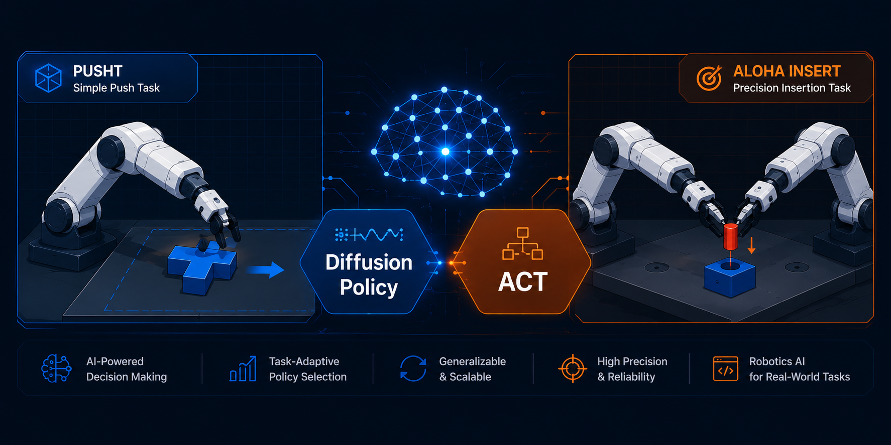
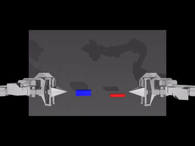
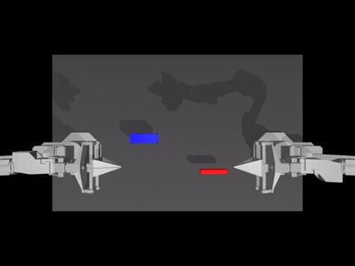
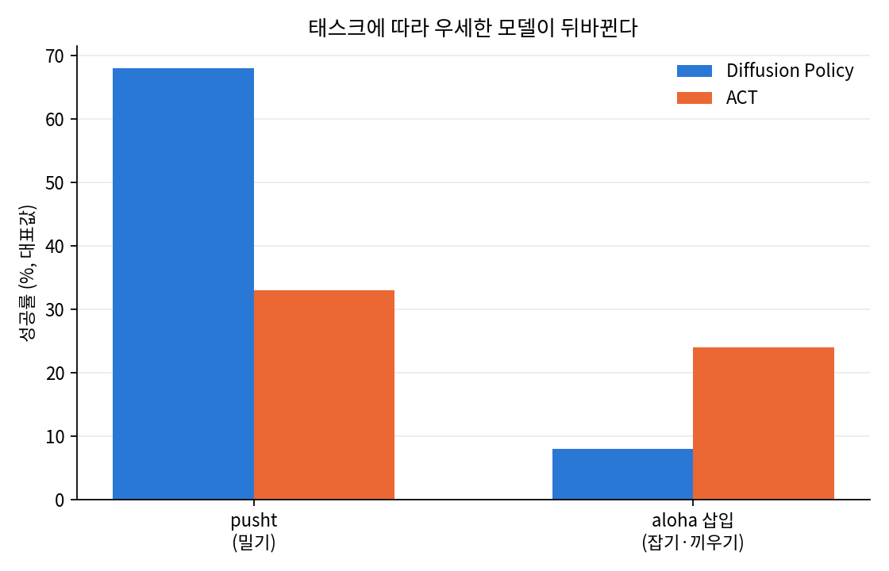
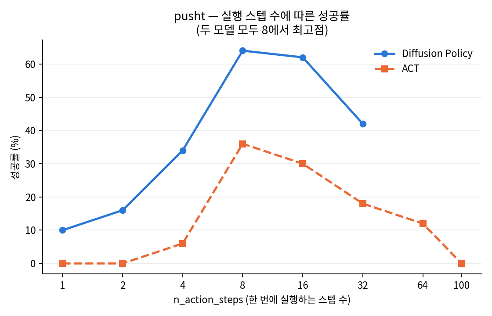
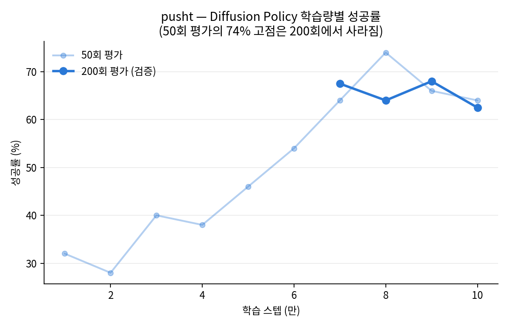
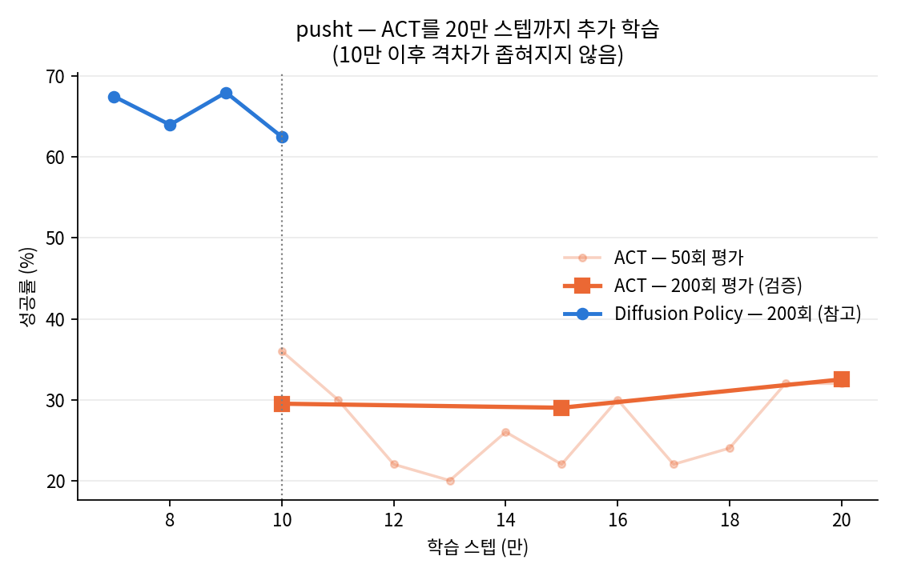
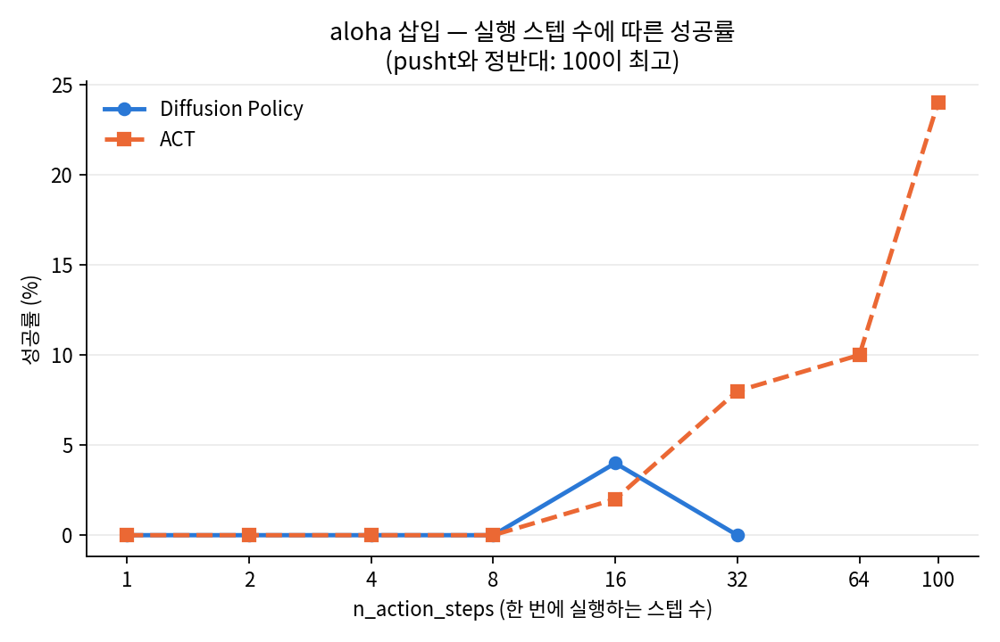
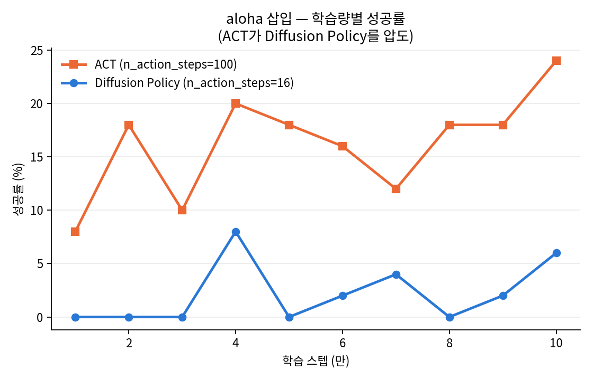

# 로봇 매니퓰레이션 정책 벤치마킹: Diffusion Policy vs ACT



**2개 태스크, 4개 모델을 처음부터 학습·검증하여, "정확도 최대 +33%p 개선"과
"태스크에 따라 최적 모델이 뒤바뀐다"는 것을 정량적으로 입증한 프로젝트입니다.**

> 이 프로젝트는 2부작입니다. **1부(현재 문서)**는 모방학습 모델을 학습·벤치마킹한
> 결과물이고, **2부**는 여기서 만든 policy들을 상황에 맞게 스스로 골라 쓰는
> 에이전트입니다. (2부: [`agent/`](./agent) — 완료)

## 무엇을 만들었는가

LeRobot 프레임워크로 **Diffusion Policy와 ACT를 사전학습 없이 직접 학습**시키고,
**두 개의 서로 다른 로봇 조작 태스크**(단일팔 밀기 · 양팔 정밀 삽입)에서 성능을
검증하는 벤치마킹 파이프라인을 구축했습니다. 학습·평가·검증을 자동화하는 재현
가능한 스크립트 9개, 200회 반복 검증을 포함한 통계적 신뢰성 확보, 결과를 한눈에
보여주는 시각화(그래프 6장·성공/실패 비교 GIF)까지 전 과정을 직접 수행했습니다.

## 핵심 성과

- **재학습 없이 성능 최대 +33%p 개선** — 실행 조건(n_action_steps)과 체크포인트
  선택만 최적화해서, 같은 학습 결과물로 ACT 성공률을 0% → 33%까지 끌어올렸습니다.
- **"이 모델이 더 낫다"는 통념을 정량적으로 반박** — pusht에서는 Diffusion Policy가
  압도적이었지만(68% vs 33%), aloha 삽입에서는 정반대로 ACT가 우세했습니다(24% vs 8%).
  단일 태스크 벤치마크의 함정을 직접 실험으로 보여줬습니다.
- **평가 표본 크기의 함정을 발견하고 검증 체계를 스스로 구축** — 50회 평가에서 나온
  74% 최고 기록이 200회 검증에서 사라지는 것을 확인하고, 이후 모든 핵심 결과에
  200회 검증을 추가했습니다.
- **가설을 세우고 직접 반증** — "ACT는 학습이 부족해서 낮다"는 가설을 세우고
  학습량을 2배(10만→20만 스텝)로 늘려 재검증, 가설을 기각했습니다.

**같은 aloha 삽입 작업, 같은 학습량(100,000 스텝) — 결과는 이렇게 다르다**

| ACT — 성공 | Diffusion Policy — 실패 |
|---|---|
|  |  |
| 핀을 잡아 소켓에 정확히 삽입 | 오른쪽 팔이 핀을 놓쳐 삽입 실패 |



## 결과 요약

**pusht — 기본 설정 대비 조정 후**

| 항목 | 기본 설정 | 조정 후 | 차이 |
|---|---|---|---|
| Diffusion Policy 성공률 | 42% | **68%** (200회 검증) | +26%p |
| ACT 성공률 | 0% | **33%** (200회 검증) | +33%p |

**두 태스크 간 비교 (각 모델의 대표 최고 성공률)**

| 태스크 | Diffusion Policy | ACT | 우세 모델 |
|---|---|---|---|
| pusht (밀기) | **68%** | 33% | Diffusion Policy |
| aloha 삽입 (잡기·끼우기) | 8% | **24%** | ACT |

## 사용 기술

`LeRobot` `PyTorch` `Diffusion Policy` `ACT (Action Chunking Transformer)`
`MuJoCo` `Hugging Face Hub` `wandb` · RTX 4070 Ti ×2 (원격 GPU 서버, 병렬 학습)

---

아래는 위 성과를 도출한 상세 실험 과정입니다.

## 실험 환경

- 태스크 1: `lerobot/pusht` — T자 블록을 목표 위치로 밀기 (겹침 95% 이상이면 성공), 206 에피소드 / 25,650 프레임
- 태스크 2: `lerobot/aloha_sim_insertion_human` — 양팔 로봇으로 핀을 튜브에 삽입
- 모델: Diffusion Policy (263M), ACT — 둘 다 사전학습 없이 각 태스크에서 처음부터 학습
- 학습: 100,000 스텝, RTX 4070 Ti ×2 (batch 64/32, aloha는 메모리 제약으로 8–32)
- 평가: 에피소드 50회 (검증 실험은 200회)

---

## 실험 1 — 같은 조건에서 두 모델 비교하기

처음 기본 설정으로 평가했을 때 결과입니다.

| 모델 | 성공률 | 에피소드당 시간 |
|---|---|---|
| Diffusion Policy | 38% | 6.6초 |
| ACT | **0%** | 0.89초 |

ACT가 완전히 실패했습니다. 학습 자체가 잘못됐다고 보기엔 loss는 정상적으로 수렴했습니다.

설정을 확인해보니 두 모델의 `n_action_steps`가 달랐습니다.

- Diffusion Policy: 64줄 예측 → **32줄 실행**
- ACT: 100줄 예측 → **100줄 전부 실행**

ACT는 화면을 100번에 한 번만 확인하고 있었습니다. 블록이 굴러가 상황이 바뀌어도
낡은 계획을 그대로 따라가는 셈입니다. **모델 성능 차이가 아니라 조건 차이였습니다.**

---

## 실험 2 — 몇 스텝마다 다시 봐야 하는가

`n_action_steps`를 1부터 100까지 바꿔가며 각각 50회씩 평가했습니다.

| n_action_steps | Diffusion | ACT |
|---|---|---|
| 1 | 10% | 0% |
| 2 | 16% | 0% |
| 4 | 34% | 6% |
| **8** | **64%** | **36%** |
| 16 | 62% | 30% |
| 32 | 42% (기본값) | 18% |
| 64 | — | 12% |
| 100 | — | 0% (기본값) |

**두 모델 모두 8에서 최고점이었습니다.**



pusht 환경은 한 에피소드당 최대 300스텝까지 진행됩니다. `n_action_steps`만큼씩 묶어
실행하므로, 관측을 다시 확인하는 횟수는 300÷N입니다.

| n_action_steps | 에피소드당 재관측 횟수 |
|---|---|
| 8 | 약 37회 |
| 32 | 약 9회 |
| 100 | 3회 |

ACT가 기본값(100)에서 0%였던 것은, 300스텝 동안 상황을 3번밖에 확인하지 못하고
나머지는 이미 지난 계획을 그대로 따라갔기 때문입니다.

양쪽 끝이 모두 나쁜 것이 핵심입니다.

- 너무 길면 → 낡은 계획을 오래 따라감
- 너무 짧으면 → 매번 새로 계산해 움직임이 흔들림

자주 다시 계산할수록 좋을 것이라는 직관과 반대되는 결과였습니다.
행동을 어느 정도 묶어서 실행해야 일관된 움직임이 나옵니다.

---

## 실험 3 — 마지막 체크포인트가 최선인가

1만 스텝마다 저장된 체크포인트 10개를 모두 평가했습니다. (`n_action_steps=8` 고정)

| 학습 스텝 | 성공률 (50회) |
|---|---|
| 10,000 | 32% |
| 20,000 | 28% |
| 30,000 | 40% |
| 40,000 | 38% |
| 50,000 | 46% |
| 60,000 | 54% |
| 70,000 | 64% |
| 80,000 | 74% |
| 90,000 | 66% |
| 100,000 | 64% |

50회 평가에서는 80,000 스텝이 74%로 가장 높았습니다. 다만 다른 실험에서
표본이 적으면(10회 vs 50회) 같은 모델의 성공률이 22%p까지 흔들리는 걸 이미 확인했던 터라,
상위 4개 구간(70,000–100,000)을 200회로 재평가했습니다.

| 학습 스텝 | 성공률 (200회) |
|---|---|
| 70,000 | 67.5% |
| 80,000 | 64.0% |
| 90,000 | **68.0%** |
| 100,000 | 62.5% |



**80,000의 74%는 표본 변동이었습니다.** 200회로 보면 70,000–100,000 스텝은
62.5–68% 사이로 사실상 동등하며, 이 구간에서는 추가 학습이 성능을 유의미하게
끌어올리지 않았습니다. "특정 체크포인트가 최적"이라는 결론보다,
**"50회 평가로는 몇 % 단위 차이를 신뢰할 수 없다"**는 것이 더 견고한 결론입니다.

### ACT는 다른 패턴을 보였다

같은 방식으로 ACT의 체크포인트 10개도 평가했습니다 (`n_action_steps=8` 고정).

| 학습 스텝 | 성공률 (50회) |
|---|---|
| 10,000 | 10% |
| 20,000 | 10% |
| 30,000 | 4% |
| 40,000 | 18% |
| 50,000 | 16% |
| 60,000 | 14% |
| 70,000 | 20% |
| 80,000 | 18% |
| 90,000 | 16% |
| 100,000 | **36%** |

중간 구간(30,000–90,000)은 들쭉날쭉했지만, 100,000 스텝에서 뚜렷하게 최고치를
기록했습니다. 상위 후보를 200회로 재검증했습니다.

| 학습 스텝 | 성공률 (200회) |
|---|---|
| 70,000 | 17.0% |
| 80,000 | 19.0% |
| 100,000 | **29.5%** |

Diffusion Policy와 달리 **순위가 뒤집히지 않았습니다.** 100,000 스텝이 200회
검증에서도 계속 1위였습니다. Diffusion은 이미 과적합 구간(7–8만 스텝 이후 정체)에
들어선 반면, ACT는 학습 종료 시점까지도 계속 개선되는 중이었다고 볼 수 있습니다.
더 오래 학습시켰다면 ACT가 추가로 나아졌을 가능성을 시사합니다.

### ACT를 20만 스텝까지 이어서 학습시켜 검증했다

"더 학습시키면 ACT가 Diffusion Policy를 따라잡을까?"라는 질문에 직접 답하기 위해,
100,000 스텝 체크포인트에서 이어서 100,000 스텝을 추가 학습시켰습니다 (총 200,000 스텝).

| 학습 스텝 | 성공률 (50회) |
|---|---|
| 100,000 (기존) | 36% |
| 110,000 | 30% |
| 130,000 | 20% |
| 160,000 | 30% |
| 190,000 | 32% |
| 200,000 | 32% |

50회 평가로는 10만 스텝이 오히려 최고처럼 보였습니다. 하지만 이전 실험에서 이미
50회 평가는 신뢰하기 어렵다는 걸 확인했으므로, 세 지점(10만/15만/20만)을 200회로
재검증했습니다.

| 학습 스텝 | 성공률 (200회) |
|---|---|
| 100,000 | 29.5% |
| 150,000 | 29.0% |
| 200,000 | 32.5% |



**세 지점이 사실상 동일했습니다.** 학습량을 2배로 늘려도(10만→20만) 성공률은
29–33% 구간에서 벗어나지 못했습니다. "ACT가 낮은 성능을 보인 것은 학습이
부족해서다"라는 가설을 직접 검증했고, 기각되었습니다. Diffusion Policy(62.5–68%)와의
격차는 추가 학습으로 좁혀지지 않았습니다.

---

## 실험 5 — 다른 태스크에서는 결론이 뒤집혔다

pusht에서 얻은 결론(Diffusion Policy가 더 정확하다, n_action_steps=8이 최적이다)이
다른 성격의 작업에서도 유지되는지 확인하기 위해, `lerobot/aloha_sim_insertion_human`
데이터셋(양팔 로봇으로 핀을 튜브에 삽입하는 작업)으로 같은 실험을 반복했습니다.

pusht는 접촉해서 미는 동작만 반복하는 반면, aloha 삽입은 잡기 → 들기 → 정렬 →
삽입까지 여러 단계를 정확한 순서로 이어가야 하는 작업입니다.

### n_action_steps 최적값이 정반대로 나왔다

| n_action_steps | ACT | Diffusion Policy |
|---|---|---|
| 1 | 0% | 0% |
| 2 | 0% | 0% |
| 4 | 0% | 0% |
| 8 | 0% | 0% |
| 16 | 2% | 4% |
| 32 | 8% | 0% |
| 64 | 10% | — |
| **100** | **24%** | — |

pusht에서는 8이 최적이고 100은 완전 실패(0%)였지만, aloha에서는 **정반대로 100이
최고**였습니다.



짧게 자주 확인하는 방식이 오히려 긴 동작의 흐름을 끊어 방해가
되는 것으로 보입니다.

### ACT가 Diffusion Policy를 압도했다

학습 스텝별로 두 모델을 비교했습니다 (ACT는 n_action_steps=100, Diffusion은 16 고정).

| 학습 스텝 | ACT | Diffusion Policy |
|---|---|---|
| 10,000 | 8% | 0% |
| 20,000 | 18% | 0% |
| 30,000 | 10% | 0% |
| 40,000 | 20% | 8% |
| 50,000 | 18% | 0% |
| 60,000 | 16% | 2% |
| 70,000 | 12% | 4% |
| 80,000 | 18% | 0% |
| 90,000 | 18% | 2% |
| 100,000 | **24%** | 6% |



pusht에서는 Diffusion Policy(62.5–68%)가 ACT(29–33%)를 크게 앞섰지만, aloha에서는
**ACT가 대부분의 구간에서 Diffusion Policy를 앞섰고**, Diffusion Policy는 10만
스텝을 다 채워도 대부분 0%대에 머물렀습니다. 완전히 반대 결과입니다.

실제 rollout 영상으로 보면 차이가 뚜렷합니다. 같은 100,000 스텝 학습, 같은 태스크에서:

| ACT — 성공 | Diffusion Policy — 실패 |
|---|---|
|  |  |

### 종합 결론

> 짧은 주기로 상황을 확인하며 유연하게 반응해야 하는 작업(pusht)에는 Diffusion
> Policy가, 긴 동작 순서를 정확하고 일관되게 재현해야 하는 작업(aloha 삽입)에는
> ACT가 유리했습니다. 어느 모델이 더 나은지는 모델 자체의 우열이 아니라
> 태스크의 성격에 달려 있습니다.

pusht 결과만 봤다면 "Diffusion Policy가 항상 더 낫다"고 잘못 일반화했을 것입니다.
두 번째 태스크를 추가한 것이 이 오류를 막았습니다.

---

## 결론

1. **벤치마크 비교에서 기본값을 그대로 쓰면 잘못된 결론이 나온다.**
   38% vs 0%로 보였던 두 모델은, 조건을 맞추자 64% vs 36%였습니다.

2. **행동 청크 길이에는 최적점이 있고, 그 값은 태스크마다 다르다.**
   pusht에서는 8, aloha 삽입에서는 100이 최적이었습니다. 짧게 자주 확인하는
   것이 항상 유리하다는 직관은 두 태스크 모두에서 성립하지 않았습니다.

3. **평가 표본이 작으면 결론이 뒤집힐 수 있다.**
   50회 평가에서 최고였던 Diffusion Policy 체크포인트가 200회로 재평가하자 순위가
   바뀌었습니다. 다만 70,000 스텝 이후로는 추가 학습의 이득이 거의 없다는 큰
   흐름은 유지됐습니다. ACT는 반대로 200회 검증에서도 순위가 그대로 유지됐습니다.

4. **정확도와 속도는 다른 축이지만, 학습량 부족이 원인은 아니었다 (pusht 기준).**
   ACT를 10만에서 20만 스텝까지 이어서 학습시켰지만 성공률은 29–33%에 머물렀고,
   Diffusion Policy(62.5–68%)와의 격차는 좁혀지지 않았습니다. "학습이 부족했다"는
   가설은 직접 검증 후 기각되었습니다.

5. **어느 모델이 더 나은지는 태스크에 따라 정반대로 뒤집힌다.**
   pusht(반응성이 중요한 밀기 작업)에서는 Diffusion Policy가 확실히 앞섰지만
   (68% vs 33%), aloha 삽입(긴 동작을 정확히 재현해야 하는 작업)에서는 ACT가
   Diffusion Policy를 압도했습니다(24% vs 8%). "이 모델이 항상 더 낫다"는 결론은
   태스크 하나만 봐서는 내릴 수 없습니다.

## 한계

- 평가 50회는 변동이 큽니다. 같은 모델이 10회 평가에서 60%, 50회에서 38%로 나왔고,
  체크포인트 비교에서도 50회 대 200회 결과가 서로 달랐습니다. aloha 실험은
  시간 관계상 200회 검증을 하지 못해, 표본 변동 가능성이 남아 있습니다.
- ACT를 20만 스텝까지 확인했으나, 그 이상 학습시켰을 때도 계속 평평할지는
  확인하지 못했습니다.
- aloha 실험에서 Diffusion Policy는 GPU 메모리 제약으로 batch_size=8,
  ACT는 batch_size=32로 서로 다른 조건에서 학습했습니다. 이 차이가 결과에
  얼마나 영향을 줬는지는 분리해서 확인하지 못했습니다.
- aloha 삽입 작업은 전반적으로 성공률이 낮아(최고 24%), 두 모델 모두 100,000
  스텝만으로는 충분히 학습되지 않았을 가능성이 있습니다.
- 시드를 고정한 단일 학습이므로, 학습 자체의 재현성은 검증하지 않았습니다.
- pusht 단일 태스크 결과이며, 다른 태스크에서 같은 경향이 나타날지는 확인하지 않았습니다.

---

## 재현 방법

```bash
# 환경 구성
conda create -y -n lerobot python=3.12
conda activate lerobot
conda install -y ffmpeg -c conda-forge
pip install 'lerobot[training,pusht,diffusion,evaluation]'
pip install gym-pusht

# 학습
lerobot-train \
  --dataset.repo_id=lerobot/pusht \
  --policy.type=diffusion \
  --policy.device=cuda \
  --steps=100000 --batch_size=64 --save_freq=10000 \
  --output_dir=outputs/diffusion_100k

# 평가 (최적 설정)
lerobot-eval \
  --policy.path=outputs/diffusion_100k/checkpoints/090000/pretrained_model \
  --env.type=pusht --eval.n_episodes=50 --eval.batch_size=1 \
  --eval.use_async_envs=false --policy.device=cuda \
  --policy.n_action_steps=8 \
  --output_dir=outputs/eval_best
```

실험 스크립트 (모두 저장소 루트에 있음):

| 스크립트 | 내용 |
|---|---|
| `run_ablation.sh` | 실험 2 — pusht, n_action_steps 스윕 (Diffusion·ACT) |
| `run_steps_curve.sh` | 실험 3 — pusht, Diffusion 학습 스텝 곡선 |
| `run_act_steps_curve.sh` | 실험 3 — pusht, ACT 학습 스텝 곡선 |
| `run_verify.sh` | 실험 3 — pusht, Diffusion 200회 검증 |
| `run_act_verify.sh` | 실험 3 — pusht, ACT 200회 검증 |
| `run_act_200k_curve.sh` | 실험 4 — pusht, ACT 20만 스텝 확장 곡선 |
| `run_act_verify2.sh` | 실험 4 — pusht, ACT 확장 학습 200회 검증 |
| `run_aloha_ablation.sh` | 실험 5 — aloha, n_action_steps 스윕 |
| `run_aloha_steps_curve.sh` | 실험 5 — aloha, 학습 스텝 곡선 |

---

## 산출물

- 학습된 모델: [Hugging Face](https://huggingface.co/ciaociao0617)
- 학습 곡선: [wandb](https://wandb.ai/ciaociao0617-individual/lerobot?nw=nwuserciaociao0617)
- 평가 영상: `outputs/eval_*/videos/`

---

## 폴더 구조

```
plots/                          README에 삽입된 결과 그래프 6장
outputs/
├── eval_act_chunk{N}/           실험 2 — ACT, n_action_steps별 결과 (pusht)
├── eval_diff_chunk{N}/          실험 2 — Diffusion, n_action_steps별 결과 (pusht)
├── eval_curve_diff_{S}/         실험 3 — Diffusion 학습 스텝별 결과 (pusht)
├── eval_act_curve_{S}/          실험 3 — ACT 학습 스텝별 결과 (pusht)
├── eval_act_verify2_{S}/        실험 4 — ACT 20만 스텝 확장 200회 검증 (pusht)
├── eval_aloha_*_chunk{N}/       실험 5 — n_action_steps별 결과 (aloha)
├── eval_aloha_*_curve_{S}/      실험 5 — 학습 스텝별 결과 (aloha)
└── */videos/                    각 평가의 rollout 영상
```