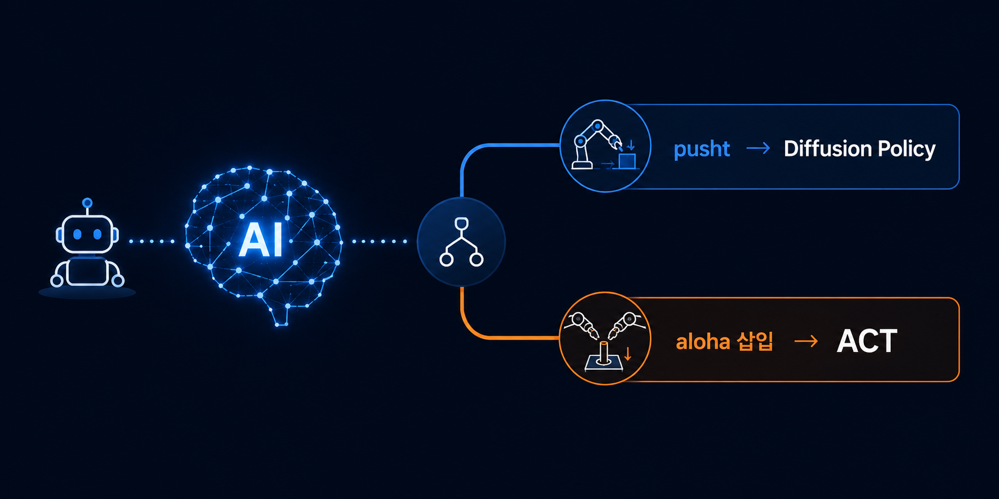

# [2부] 로봇 Policy 선택 에이전트



1부에서 벤치마킹한 4개의 policy(pusht·aloha × Diffusion Policy·ACT)를,
**상황에 맞게 스스로 골라 실행하는 에이전트**를 만들었습니다.

사람이 "어떤 작업을 해달라"고 목표만 말하면, 에이전트가 1부에서 얻은 벤치마킹
결과를 근거로 최적의 모델과 실행 설정을 스스로 판단하고, 실제로 실행한 뒤
결과를 검증해서 보고합니다.

## 동작 흐름

```
사람: "aloha 삽입 작업 해줘"
        ↓
에이전트가 1부 벤치마킹 결과를 근거로 판단
   "aloha는 ACT가 우세하니(24% vs 8%) aloha_act를 쓰자"
        ↓
lerobot-eval을 자동으로 구성해 실행
        ↓
결과(성공률)를 확인
        ↓
성공률이 낮으면(30% 미만) → 에이전트가 스스로 재검토
   "같은 걸 재시도할지, 다른 policy로 바꿀지, 멈출지"를 다시 판단
        ↓
최종 결과 보고
```

단순히 판단 한 번, 실행 한 번으로 끝나지 않고, **결과를 보고 스스로 다음 행동을
정하는 재시도 루프**를 넣었습니다.

## 아키텍처

```
agent/
├── knowledge.py   1부 벤치마킹 결과 + 사용 가능한 policy 목록
├── tools.py        policy를 실제로 실행하고 결과를 파싱하는 함수
└── agent.py         Llama 3에게 판단을 요청하고 실행을 지휘하는 메인 로직
```

- **판단 담당**: Llama 3.1(8b) — Ollama로 로컬 GPU에서 무료 구동 (API 비용 없음)
- **지식**: 1부 실험에서 확인된 사실을 프롬프트에 직접 포함 (RAG 없이 단순 주입)
- **실행**: Python `subprocess`로 `lerobot-eval` 명령을 자동 구성·실행
- **검증**: 실행 결과(`eval_info.json`)를 파싱해 실제 성공률로 보고

## 테스트 결과

| 요청 | 에이전트의 선택 | 1부 기준 정답 | 실행 결과 (20회) |
|---|---|---|---|
| "aloha 삽입 작업 해줘" | aloha_act | ✅ aloha_act | 40% |
| "pusht 밀기 작업 해줘" | pusht_diffusion | ✅ pusht_diffusion | 80% |
| "정밀하게 작업해야 하지만 diffusion 방식으로 해줘" | pusht_diffusion | ❌ (의도는 aloha_diffusion) | 80% |

앞의 두 테스트는 태스크 이름을 직접 언급한 요청이라, 1부 벤치마킹 결과와
일치하는 policy를 정확히 선택하고 실행까지 완료했습니다.

세 번째는 태스크 이름 없이 "정밀함"이라는 성격만 준 의도적으로 어려운 요청이었습니다.
"정밀한 작업 = aloha 삽입"이라는 연결을 기대했지만, 에이전트는 "diffusion"이라는
표면적 단어에 끌려 pusht_diffusion을 선택했습니다. 이 실패 사례는 아래 한계
섹션에서 자세히 다룹니다.

## 왜 로컬 LLM(Llama 3)을 썼는가

Claude나 GPT 같은 상용 API 대신 Ollama + Llama 3.1(8b)을 로컬에서 구동했습니다.

- 이미 확보한 GPU 서버 자원을 그대로 활용 (추가 비용 없음)
- policy 선택처럼 제한된 선택지 중에서 고르는 판단은 8B급 소형 모델로도 충분
- API 키 발급이나 네트워크 의존 없이 완전히 자체 구동 가능

## 한계 — 소형 모델의 추론 실패 사례

가장 의미 있는 발견은 실패 사례에서 나왔습니다. `knowledge.py`에 "반응성이
중요한 작업에는 Diffusion Policy" 같은 **결론 문장을 미리 적어둔 상태**에서는
문구가 겹치는 요청에 정답을 잘 찾았습니다. 하지만 결론 문장을 빼고 **원인
(두 모델의 계산 방식 차이)만 적어둔 뒤**, "정밀하게 작업해야 하지만 diffusion
방식으로 해줘"라는 의도적으로 모순적인 요청을 던지자:

- 기대: "정밀함 = aloha 삽입 태스크"임을 스스로 추론해 `aloha_diffusion`을 선택
- 실제: "diffusion"이라는 단어에 끌려 `pusht_diffusion`을 선택 (태스크 자체를 잘못 특정)

**8B급 소형 로컬 모델은, 지식 파일에 결론이 명시되지 않은 경우 표면적 키워드에
의존하는 경향을 보였습니다.** 우연히 실행 결과가 80%로 높게 나와 재시도 로직도
발동하지 않았는데, 이는 "틀린 태스크를 골랐어도 그 policy 자체는 원래 성능이
좋았기 때문"입니다. 즉 성공률만으로는 판단이 올바른 태스크를 겨냥했는지까지는
검증하지 못한다는 것도 함께 드러났습니다.

## 그 외 한계

- 판단 근거를 프롬프트에 텍스트로 직접 넣는 방식(RAG 없음)이라, 지식이 늘어나면
  프롬프트가 길어지는 구조적 한계가 있습니다.
- 화면(카메라 이미지)을 직접 보고 판단하는 게 아니라, 텍스트 요청만으로 태스크를
  분류합니다. pusht·aloha처럼 시뮬레이터 자체가 다른 태스크 간에는 실행 중 전환이
  불가능해, 에피소드 단위로만 policy를 선택합니다.
- 재시도 로직은 "성공률이 낮다"만 판단 기준으로 삼습니다. 위 사례처럼 성공률이
  높아도 애초에 잘못된 태스크를 선택한 경우는 걸러내지 못합니다.

## 재현 방법

```bash
# Ollama 설치 (sudo 없이)
mkdir -p ~/ollama && cd ~/ollama
curl -L https://ollama.com/download/ollama-linux-amd64.tar.zst -o ollama-linux-amd64.tar.zst
tar --zstd -xf ollama-linux-amd64.tar.zst -C ~/ollama
export PATH=$HOME/ollama/bin:$PATH

# 서버 실행 (별도 세션에서 계속 유지)
ollama serve

# 모델 다운로드
ollama pull llama3.1:8b

# 에이전트 실행
conda activate lerobot
python agent/agent.py
```